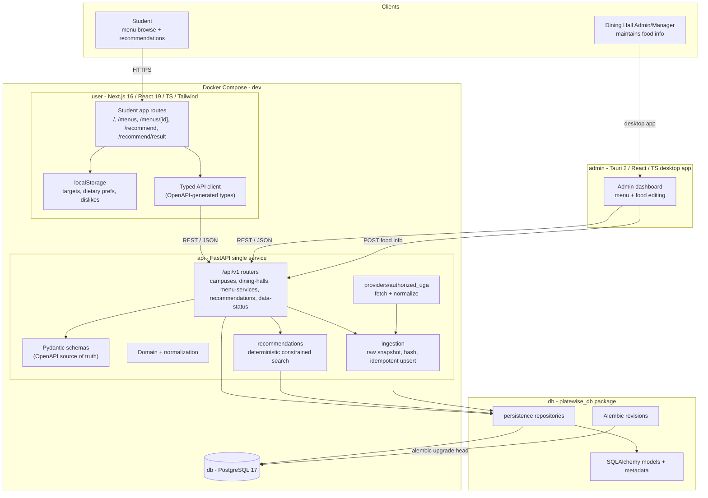
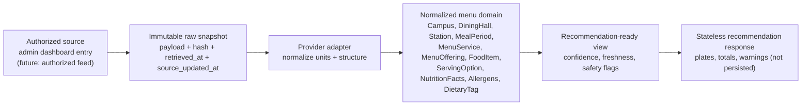

# PlateWise MVP - System Architecture

Scope: MVP only. One campus (UGA), guest mode, local-browser preferences, deterministic
recommendations, single backend service, and the authorized dining-hall admin dashboard as the data
source of record. No auth service, Redis, Celery, workers, or microservices at this stage.

## Container / component diagram

## Data layers

The system keeps four separate data categories so raw source data is never silently mixed with
product or user data.

## Key architectural decisions

- **Single deployable backend** in `api/src/platewise_api`, with routes, schemas, importer
  orchestration, source adapters, and recommendations. Persistence is an explicit dependency in
  `db/src/platewise_db`; it is a package boundary, not another network service.
- **Separate admin desktop client (updated 2026-07-20).** The dining-hall staff dashboard is a
  separate Tauri 2 + React + TypeScript desktop application (`apps/admin`), not routes inside the
  student web app; earlier revisions of this document that placed admin routes inside `web` are
  superseded. `api` remains the single backend for both clients, `db` owns the persistence
  package and migrations, and no client connects to PostgreSQL directly. The admin app runs on
  the host and is not a Compose service.
- **Admin dashboard is the authorized data source** for the MVP; writes flow through the same
  FastAPI service into raw snapshots, then idempotent normalized upserts (`(provider, external_id,
  service_date)` unique). Re-import of the same snapshot is a no-op.
- **Alembic is owned by `db`.** Migrations run from `db/alembic`; Compose intentionally has only
  `db`, `api`, and `user` services and does not add an automation service.
- **Recommendations are computed, not stored.** `POST /api/v1/recommendations` runs a deterministic
  constrained search and returns plates with totals, confidence, freshness, and warning codes.
- **Local-first preferences.** Student targets, dietary preferences, and dislikes live in
  `localStorage`; they are never written to the server (no accounts in MVP).
- **Single OpenAPI contract.** Frontend TypeScript types are generated from the FastAPI OpenAPI
  schema; Python and TypeScript never define competing versions of the same response.
- **Safety and freshness first.** Missing nutrition is surfaced as unknown (never zero),
  unknown-allergen items are excluded from recommendations, portion caps are enforced, and stale or
  partial data produces visible warnings.

## Deliberately excluded from the MVP

Authentication/accounts, profile sync, Redis, Celery/queues, Kubernetes, native student apps,
multi-campus abstractions beyond a simple provider boundary, ML/LLM food selection, and persistent
recommendation history.
